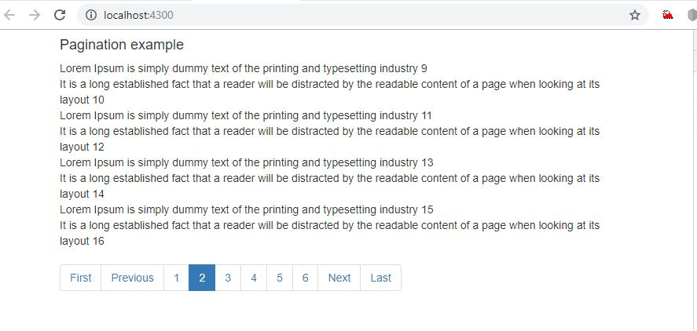

# Angular7 Patination component


It is a Angular7 pagination component, the data of the pagination is getting from web API. It can customize easily the populate list count and no of pagination list.

<p align="center">
    
</p>

To preview demo of Angular7 pagination project, [click here](https://angular-paginationexample.stackblitz.io)


## Getting Started
Download  or Clone the repository in your machine and run following command.

### Installing
    - npm install

### Run server
    - ng serve
    
## Below are the steps to build this component


### Import the components on app.module

In `app.module.ts`,

```javascript
...

import { FormsModule } from '@angular/forms';
import {HttpClientModule} from '@angular/common/http';
import { AppComponent } from './app.component';
import { PaginationComponent } from './pagination.component';


declarations: [
    AppComponent,
    PaginationComponent
     ],
  imports: [
    BrowserModule, FormsModule, HttpClientModule
  ],

```

### Usage : 

In `pagination.component.ts`,

```javascript
import { Component, Input, Output, EventEmitter, OnInit, OnChanges, SimpleChanges } from '@angular/core';

@Component({
  selector: 'pagination',
  template: `<ul *ngIf="pager.pages && pager.pages.length" class="pagination">
  <li [ngClass]="{disabled:pager.currentPage === 1}">
      <a (click)="setPage(1)">First</a>
  </li>
  <li [ngClass]="{disabled:pager.currentPage === 1}">
      <a (click)="setPage(pager.currentPage - 1)">Previous</a>
  </li>
  <li *ngFor="let page of pager.pages" [ngClass]="{active:pager.currentPage === page}">
      <a (click)="setPage(page)">{{page}}</a>
  </li>
  <li [ngClass]="{disabled:pager.currentPage === pager.totalPages}">
      <a (click)="setPage(pager.currentPage + 1)">Next</a>
  </li>
  <li [ngClass]="{disabled:pager.currentPage === pager.totalPages}">
      <a (click)="setPage(pager.totalPages)">Last</a>
  </li>
</ul>`,
})

export class PaginationComponent implements OnInit, OnChanges {
  @Input() items: Array<any>;
  @Output() changePage = new EventEmitter<any>(true);
  @Input() initialPage = 1;
  @Input() pageSize = 10;
  @Input() maxPages = 5;
  pager: any = {};
  ngOnInit() {
    if (this.items && this.items.length) {
      this.setPage(this.initialPage);
    }
  }
 paginate(
  totalItems: number,
  currentPage: number = 1,
  pageSize: number = 10,
  maxPages: number = 5
) {
  let totalPages = Math.ceil(totalItems / pageSize);

  if (currentPage < 1) { 
      currentPage = 1; 
  } else if (currentPage > totalPages) { 
      currentPage = totalPages; 
  }

  let startPage: number, endPage: number;
  if (totalPages <= maxPages) {
    startPage = 1;
    endPage = totalPages;
  } else {
    let maxPagesBeforeCurrentPage = Math.floor(maxPages / 2);
    let maxPagesAfterCurrentPage = Math.ceil(maxPages / 2) - 1;
    if (currentPage <= maxPagesBeforeCurrentPage) {
      startPage = 1;
      endPage = maxPages;
    } else if (currentPage + maxPagesAfterCurrentPage >= totalPages) {
      startPage = totalPages - maxPages + 1;
      endPage = totalPages;
    } else {
      startPage = currentPage - maxPagesBeforeCurrentPage;
      endPage = currentPage + maxPagesAfterCurrentPage;
    }
  }
  let startIndex = (currentPage - 1) * pageSize;
  let endIndex = Math.min(startIndex + pageSize - 1, totalItems - 1);

  let pages = Array.from(Array((endPage + 1) - startPage).keys()).map(i => startPage + i);
  return {
    totalItems: totalItems,
    currentPage: currentPage,
    pageSize: pageSize,
    maxPages: maxPages,
    totalPages: totalPages,
    startPage: startPage,
    endPage: endPage,
    startIndex: startIndex,
    endIndex: endIndex,
    pages: pages
  };
}
  ngOnChanges(changes: SimpleChanges) {
    if (changes.items.currentValue !== changes.items.previousValue) {
      this.setPage(this.initialPage);
    }
  }
  private setPage(page: number) {
    this.pager = this.paginate(this.items.length, page, this.pageSize, this.maxPages);

    var pagingItems = this.items.slice(this.pager.startIndex, this.pager.endIndex + 1);

    this.changePage.emit(pagingItems);
  }
}

```

In `app.component.ts`,
```javascript

import { Component, OnInit } from '@angular/core';
import { HttpClient, HttpHeaders  } from '@angular/common/http';

@Component({
  selector: 'my-app',
  templateUrl: './app.component.html',
  styleUrls: [ './app.component.css' ]
})

export class AppComponent implements OnInit {
    constructor(private http: HttpClient) { }

    items: Array<any>;
    results:any;
    pagingItems: Array<any>;

    ngOnInit() {        
    var url = "../assets/pagination-data.json";
    this.http.get(url).subscribe(
      result => {this.results = result;},
       err => console.error(err), 
         () => console.log('done')  
       );            
    }
    onChangePage(pagingItems: Array<any>) {
        this.pagingItems = pagingItems;
    }    
}


```
In `app.component.html`,

```html
<div class="container">

<h4> Pagination example </h4>

<div *ngFor="let item of pagingItems">{{item.name}}</div>
<!--manage list size and pagination link [pageSize]="8" [maxPages]="6"-->   
<pagination [items]="results" [pageSize]="8" [maxPages]="6"   (changePage)="onChangePage($event)"></pagination>

</div>

```

